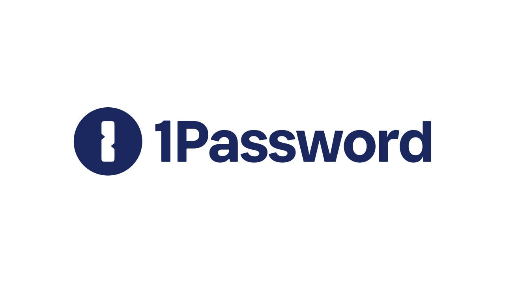

<div align="left">

[](https://1password.com)

# [1password](https://1password.com)<a id="1password"></a>

Trusted by more than 100,000 businesses to protect their data, 1Password gives you complete control over passwords and other sensitive business information. 

As an integral layer of the Identity and Access Management (IAM) stack, 1Password protects all employee accounts – even those you aren't aware of. Give employees secure access to any app or service and safely share everything you need to work together – including logins, documents, credit cards, and more – while keeping everything else private.

1Password is easy to deploy and integrates with Azure AD, Okta, OneLogin, and Slack, so you can automatically provision employees using the systems you already trust. It's simple to manage and fits seamlessly into your team's workflow, so you can secure your business without compromising productivity.

</div>

## Table of Contents<a id="table-of-contents"></a>

<!-- toc -->

- [Installation](#installation)
- [Getting Started](#getting-started)
- [Reference](#reference)
  * [`onepasswordpartnership.account.beginProvisioningProcess`](#onepasswordpartnershipaccountbeginprovisioningprocess)
  * [`onepasswordpartnership.account.getByUid`](#onepasswordpartnershipaccountgetbyuid)
  * [`onepasswordpartnership.account.removeFromPartnership`](#onepasswordpartnershipaccountremovefrompartnership)
  * [`onepasswordpartnership.account.updateEndsAtByUid`](#onepasswordpartnershipaccountupdateendsatbyuid)

<!-- tocstop -->

## Installation<a id="installation"></a>
<div align="center">
  <a href="https://konfigthis.com/sdk-sign-up?company=1Password&serviceName=Partnership&language=TypeScript">
    
  </a>
</div>

## Getting Started<a id="getting-started"></a>

```typescript
import { OnePasswordPartnership } from "1-password-partnership-typescript-sdk";

const onepasswordpartnership = new OnePasswordPartnership({
  // Defining the base path is optional and defaults to https://billing.b5test.eu
  // basePath: "https://billing.b5test.eu",
  accessToken: "ACCESS_TOKEN",
});

const beginProvisioningProcessResponse =
  await onepasswordpartnership.account.beginProvisioningProcess({
    customer_account_uid: "customer_account_uid_example",
    account_type: "account_type_example",
    domain: "domain_example",
  });

console.log(beginProvisioningProcessResponse);
```

## Reference<a id="reference"></a>


### `onepasswordpartnership.account.beginProvisioningProcess`<a id="onepasswordpartnershipaccountbeginprovisioningprocess"></a>

Begins provisioning process for a new partner associated 1Password account.

#### 🛠️ Usage<a id="🛠️-usage"></a>

```typescript
const beginProvisioningProcessResponse =
  await onepasswordpartnership.account.beginProvisioningProcess({
    customer_account_uid: "customer_account_uid_example",
    account_type: "account_type_example",
    domain: "domain_example",
  });
```

#### ⚙️ Parameters<a id="⚙️-parameters"></a>

##### customer_account_uid: `string`<a id="customer_account_uid-string"></a>

A unique identifier for the end user\\\'s account to be provisioned. It can be up to 80 chars long and consist of alphanumeric characters and hyphens.

##### account_type: `string`<a id="account_type-string"></a>

Specifies the type of 1Password account plan to provision - \\\'I\\\' for Individual, or \\\'F\\\' for family.

##### domain: `string`<a id="domain-string"></a>

Specifies the 1Password domain to provision the account for. For testing it can be one of \\\'b5test.com\\\', \\\'b5test.ca\\\', or \\\'b5test.eu\\\'. For production, it can be one of \\\'1password.com\\\', \\\'1password.ca\\\', or \\\'1password.eu\\\'. Note that domains can only be used after promotions have been created for a given partnership in the specific domain.

##### ends_at: `string`<a id="ends_at-string"></a>

Specifies when the 1Password account will be frozen, formatted in RFC-3339.

#### 🔄 Return<a id="🔄-return"></a>

[Account](./models/account.ts)

#### 🌐 Endpoint<a id="🌐-endpoint"></a>

`/api/v1/partners/accounts` `POST`

[🔙 **Back to Table of Contents**](#table-of-contents)

---


### `onepasswordpartnership.account.getByUid`<a id="onepasswordpartnershipaccountgetbyuid"></a>

Returns an account based on an UID.

#### 🛠️ Usage<a id="🛠️-usage"></a>

```typescript
const getByUidResponse = await onepasswordpartnership.account.getByUid({
  customerAccountUid: "customerAccountUid_example",
});
```

#### ⚙️ Parameters<a id="⚙️-parameters"></a>

##### customerAccountUid: `string`<a id="customeraccountuid-string"></a>

Unique ID of an account to retrieve.

#### 🔄 Return<a id="🔄-return"></a>

[Account](./models/account.ts)

#### 🌐 Endpoint<a id="🌐-endpoint"></a>

`/api/v1/partners/accounts/{customer_account_uid}` `GET`

[🔙 **Back to Table of Contents**](#table-of-contents)

---


### `onepasswordpartnership.account.removeFromPartnership`<a id="onepasswordpartnershipaccountremovefrompartnership"></a>

Removes an account from the partnership domain.

#### 🛠️ Usage<a id="🛠️-usage"></a>

```typescript
const removeFromPartnershipResponse =
  await onepasswordpartnership.account.removeFromPartnership({
    customerAccountUid: "customerAccountUid_example",
  });
```

#### ⚙️ Parameters<a id="⚙️-parameters"></a>

##### customerAccountUid: `string`<a id="customeraccountuid-string"></a>

Unique ID of partner_account to delete.

#### 🌐 Endpoint<a id="🌐-endpoint"></a>

`/api/v1/partners/accounts/{customer_account_uid}` `DELETE`

[🔙 **Back to Table of Contents**](#table-of-contents)

---


### `onepasswordpartnership.account.updateEndsAtByUid`<a id="onepasswordpartnershipaccountupdateendsatbyuid"></a>

Updates the ends_at attribute of an account based on an UID.

#### 🛠️ Usage<a id="🛠️-usage"></a>

```typescript
const updateEndsAtByUidResponse =
  await onepasswordpartnership.account.updateEndsAtByUid({
    customerAccountUid: "customerAccountUid_example",
    ends_at: "1970-01-01T00:00:00.00Z",
  });
```

#### ⚙️ Parameters<a id="⚙️-parameters"></a>

##### ends_at: `string`<a id="ends_at-string"></a>

Specifies when the 1Password account will be frozen, formatted in RFC-3339.

##### customerAccountUid: `string`<a id="customeraccountuid-string"></a>

Unique ID of partner_account to update.

#### 🔄 Return<a id="🔄-return"></a>

[Account](./models/account.ts)

#### 🌐 Endpoint<a id="🌐-endpoint"></a>

`/api/v1/partners/accounts/{customer_account_uid}` `PATCH`

[🔙 **Back to Table of Contents**](#table-of-contents)

---


## Author<a id="author"></a>
This TypeScript package is automatically generated by [Konfig](https://konfigthis.com)
